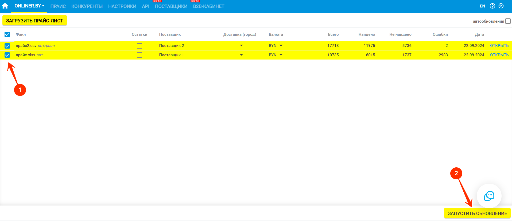
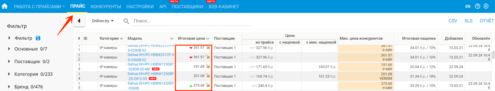
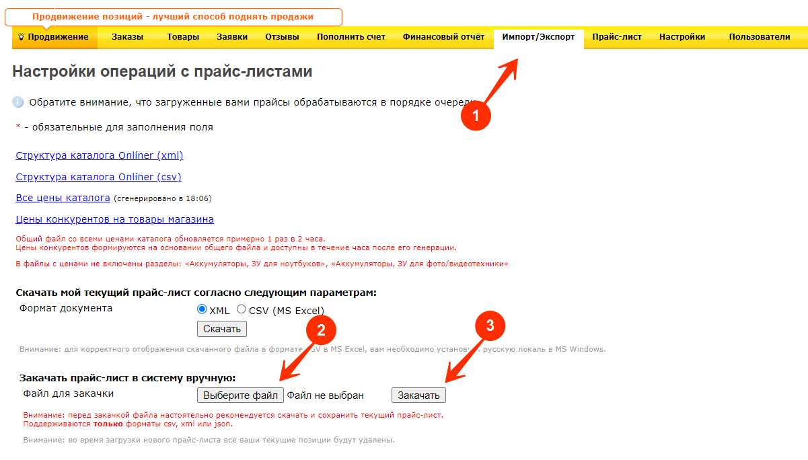
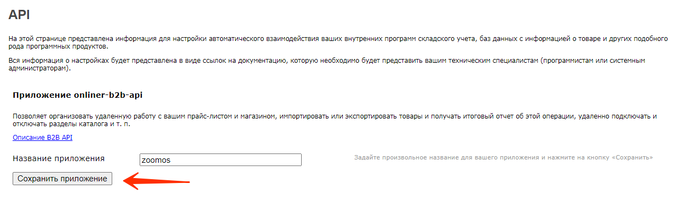
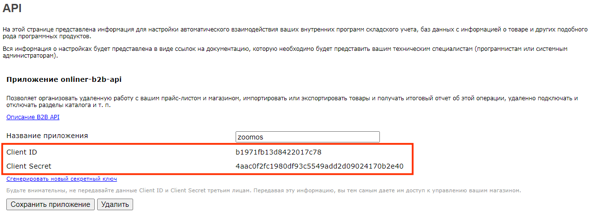
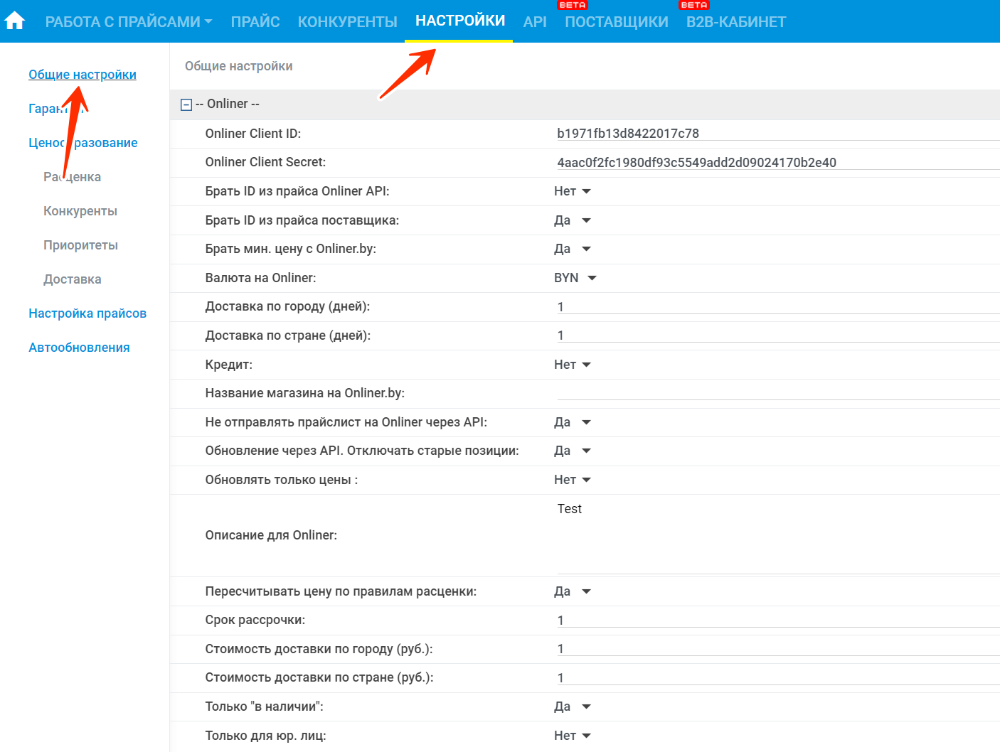
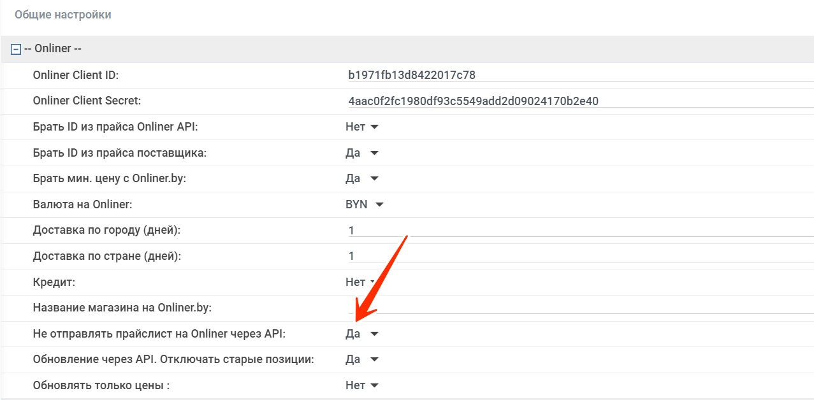

# Обновление торговой площадки

Существует два варианта обновления:

1. _Обновление по прайс-листам поставщиков._
2. _Автоматическое обновление по ссылке с сайта._

## Обновление по прайс-листам поставщиков

Для обновления цен и статусов товаров по прайсам поставщиков выполните следующие шаги:

1\. Зайдите на страницу торговой площадки Onliner.by. _Работа с прайсами → Onliner.by_

2\. [Загрузите](../sites-update/price-handler/index.yaml) прайс (прайс-лист поставщика или скачанный с площадки).

3\. [Отметьте столбцы](../sites-update/price-handler/price-handler.md#пример-сопоставления-столбцов) из прайса, где находятся производитель, модель, цена, статус товаров и др.

4\. Нажмите «Продолжить» и дождитесь завершения процесса (100%).

5\. После завершения нажмите «Открыть» справа от прайса.

6\. Проверьте ненайденные товары, которые не были автоматически сопоставлены, и [сопоставьте их вручную](../mapping/mapping-instruction-file.md).

7\. Отредактируйте название товара в первом столбце, чтобы программа могла подсветить нужную модель. Если модель не найдена, проверьте ее на сайте площадки и вставьте ссылку на товар вручную.

8\. Перейдите в «Настройки - [Расценка](../sites-update/pricing/quotation.md)» и настройте правила ценообразования.

9\. Вернитесь на страницу площадки, выберите прайсы для обновления и нажмите «Запустить обновление».







10\. После завершения процесса перейдите на страницу «Прайс» и проверьте колонку «Итоговая цена» — она уйдет на площадку.

11\. Сохраните файл обновления по завершению процесса формирования.

12\. Загрузите файл в личный кабинет торговой площадки (для Onliner.by можно настроить автоматическую отправку).

## Автоматическое обновление по ссылке

Для автоматического обновления товаров на площадке:

1\. Предоставьте постоянную ссылку на выгрузку ваших товаров (с наименованием, id, ценой, статусом и др.).

2\. Мы настраиваем автоматическую выгрузку товаров на торговую площадку.

<!-- 3\. Укажите ссылку в личном кабинете площадки для обновления. -->
3\. Настройте интервал обновления (любой удобный).

## Описание столбцов:

- _Производитель_ — столбец с производителем устройства.
- _Модель_ — столбец с моделью устройства.
- _Код производителя_ — артикул производителя (если нет, пропускаем).
- _Цена_ — столбец с ценой, валюта указана в прайсе (можно настроить курс пересчета).
- _Статус_ — столбец с наличием товара (_«под заказ»_, _«в наличии»_, _«нет в наличии»_).
- _Количество_ — остатки товара в числовом выражении.
- _ID_ — код товара у поставщика.

## Автоматическая отправка файла обновления на Onliner.

Для настройки автоматической отправки файла обновления после формирования обновления на площадку onliner.by,
необходимо добавить обязательную информацию в личном кабинете zoomos.

1. Ключи:

   - _Onliner Client ID_  
   - _Onliner Client Secret_

   Получить их можно в B2B кабинете Onliner на вкладке импорт/экспорт.

##### Создайте приложение "onliner-b2b-api"

#####  Используйте сгенерированные ключи

   

2\. Заполните информацию о доставке и описание в настройках (раздел _«блок онлайнера»_).

3\. Укажите недостающую информацию во вкладке _«Гарантия»_ (обязательно для обновлений).

4\. Проверьте правильность формирования данных на вкладке прайс (цены, статусы).

5\. Сделайте бэкап в B2B кабинете перед включением автоматической отправки, чтобы иметь возможность вернуть данные в случае ошибки.

6\. После всех проверок включите автоматическую отправку, переключив настройку _«Не отправлять прайслист на Onliner через API»_ в положение «нет».



Все изменения в настройках необходимо сохранить. 



[*update_generation]: 