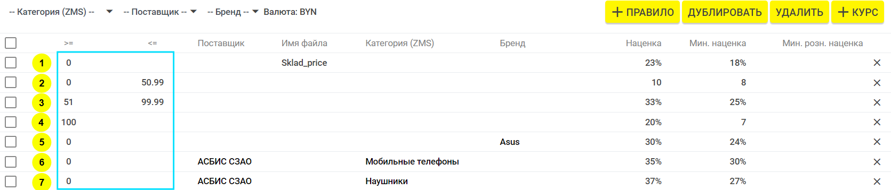
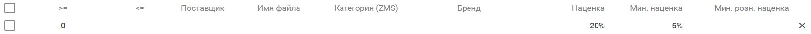
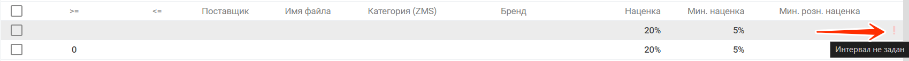
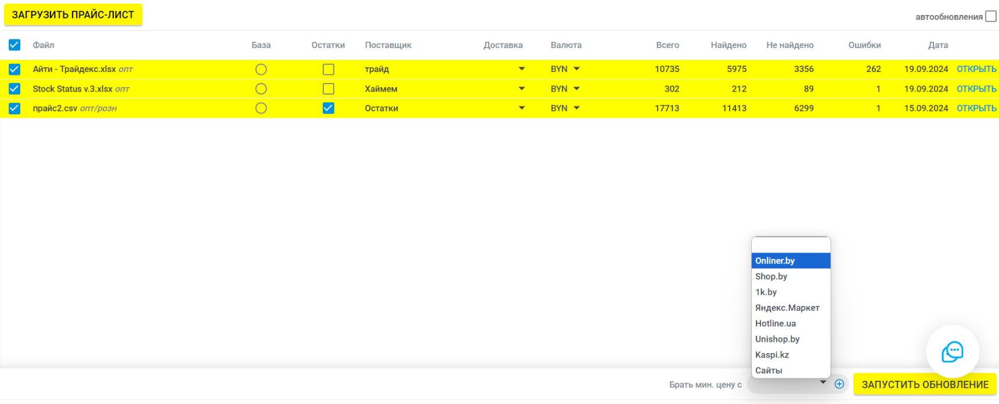
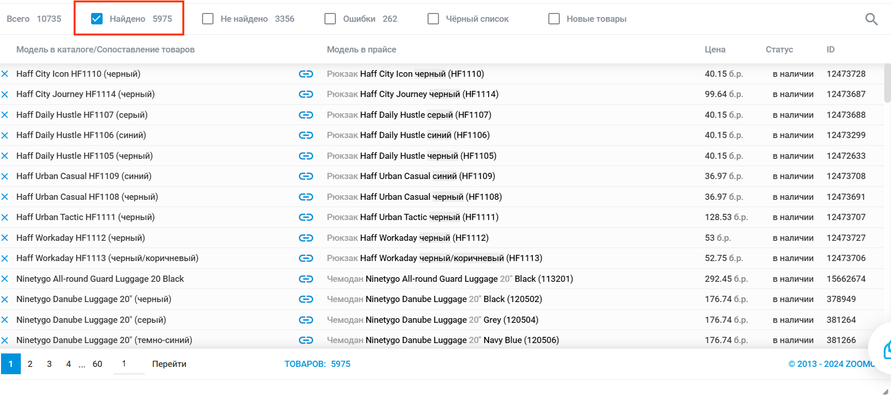

# Расценка товаров и формирование розничных цен

## 1. Общая информация



**Важно:** Расценка применяется только для прайсов с типом цен **«ОПТ»**, который выбирается при загрузке прайса.



Если расценка не используется, достаточно выбрать тип цен **«РОЗНИЦА»**.

Если в прайсе указаны две колонки («Цена» и «РРЦ»), необходимо выбрать тип цен **«ОПТ»**. В этом случае сначала берётся **РРЦ**, а при его отсутствии — **оптовая цена** (согласно правилам).

Также можно выставить приоритет для прайса, чтобы при совпадении позиций цены выставлялись именно из него. Для этого при формировании обновления напротив нужного файла отметьте галочку **«Остатки»**.

## 2. Критерии расценки

Настройка расценки может быть выполнена по следующим критериям:

- **Интервал цен**: применять правило для товаров с ценой, входящей в указанный интервал.
- **Поставщик**: указать нужных поставщиков, к которым применяются заданные правила.
- **Имя файла**: применить к прайс-листам с определённым названием.
- **Категория (ZMS)**: настроить расценку для выбранных категорий.
- **Производитель**: выбрать нужного производителя.

**Пример:**

## 3. Интервал цен

При настройке интервалов цен обязательно указывайте границы интервала (достаточно одной из границ):

- **≥ (минимальная цена "от")** — например, цена от 0.
- **≤ (максимальная цена "до")** — например, цена до 50.99.

**Пример:**

**Правила:**

1. **№1**: применимо ко всем позициям с ценой от 0 до бесконечности для прайсов с именем файла **"Sklad_price"**.
2. **№2 и №3**: применимы к позициям в интервале от 0 до 50.99 и от 51 до 99.99 соответственно.
3. **№4**: применяется ко всем позициям с ценой от 100 до бесконечности.
4. **№5**: применяется ко всем позициям с ценой от 0 до бесконечности только для товаров бренда **"Asus"**.
5. **№6**: применяется ко всем позициям с ценой от 0 до бесконечности только для товаров поставщика **"АСБИС СЗАО"** и категории **"Мобильные телефоны"**.
6. **№7**: применяется ко всем позициям с ценой от 0 до бесконечности только для товаров поставщика **"АСБИС СЗАО"** и категории **"Наушники"**.



**Рекомендация:** Добавляйте общее правило расценки, которое будет действовать на все товары без указания фильтров. В этом случае все товары всегда будут расцениваться, даже когда товар не попадает ни под одно индивидуальное правило.



Если в созданном правиле есть ошибка, об этом будет указывать восклицательный знак рядом с правилом.

## 4. Основные значения

- **Наценка** — сумма, на которую повышена цена (число в валюте, % или формула). Если нет конкурентов.
- **Минимальная наценка** — применяется только **при наличии конкурентов**.
- **Минус от минимальной цены конкурентов** — сумма, на которую уменьшается минимальная цена конкурента при условии, если на товар берётся минимальная цена конкурента.
- **Минимальная розничная наценка** — если разница между РРЦ и входной ценой меньше определённого %, цена формируется как **"входная цена + %"**, указанный в этой ячейке.



У вас есть определённый минимум по наценке, ниже которого вы не хотите работать. В этом случае, если разница между оптовой ценой и РРЦ будет ниже данного значения, система выставит цену по формуле: **"ОПТ + Минимальная розничная наценка %"**.



- **Приоритет** — многоуровневая система наценки: сначала применяется одно правило (например, скидка), затем другое (наценка). Пересчёт работает по порядку, указанному в столбце **«Приоритет»**.

**Пример:**

В данном примере к прайсу поставщика сначала применяется правило с приоритетом **"0"** (входная цена - 2%). Затем применяется правило с приоритетом **"1"** (цена -2% + наценка) и т.д.



**Важно:** Все значения должны быть указаны в валюте результата (той, в которой обновляете магазин), а не в валюте прайса.



## 5. Расценка под минимальные цены конкурентов

Если необходимо выравнивать цены по минимальным ценам конкурентов:

- В столбце **«Наценка»** укажите значение **"0"** — если нет конкурентов, цена берётся из прайса.
- В столбце **«Минимальная наценка»** укажите **"-50 000"** (или другое большое отрицательное число) — все цены будут выравниваться по минимальным.

**Пример:**

Использование минимальных цен конкурентов с торговых площадок (например, Onliner):

*Проверьте, чтобы в соответствующей вкладке (например, Onliner) были прописаны соответствия по вашим товарам. Цены конкурентов не учитываются для позиций без соответствий («не найденные»).*

Чтобы быстро отправить товары с сайта в соответствующую вкладку (для прописывания соответствий к торговой площадке), выполните следующие действия:

Цены конкурентов не учитываются для позиций без соответствий (товары из блока «[Найдено]\(*Найдено)»).

## 6. Фильтры

Для быстрого поиска или сортировки параметров расценок можно использовать фильтры, доступные в верхней части страницы. Фильтры работают по следующим критериям:

- **Категория**
- **Бренд**
- **Поставщик**

Если поставщик, производитель или категория не указаны, правило применяется ко всем товарам.

## 7. Курсы валют

В общих настройках аккаунта (вкладка **«Настройки»**) можно задать курс валюты с привязкой к Национальному банку. Например, для курса НБРБ + 2% используйте формулу **`[NBRB]+2%`**.

На странице **«Расценка»** можно задать отдельный курс для каждого поставщика.

## 8. Чёрный и белый список конкурентов

При формировании цен можно использовать чёрный и белый списки конкурентов:

- **Использовать цены конкурентов** — добавьте только названия магазинов, цены которых нужно учитывать.
- **Исключать при расценке конкурентов** — расценка выполняется по всем конкурентам, кроме тех, что внесены в чёрный список.

**Пример:**

[\*Найдено]: 
