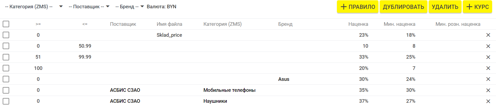
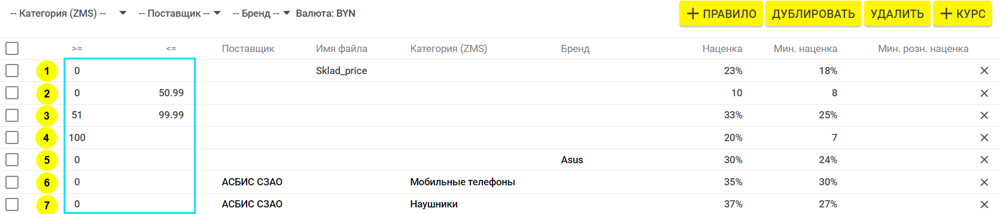
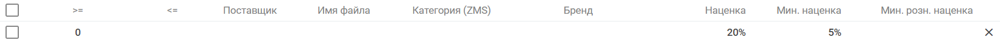
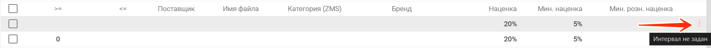
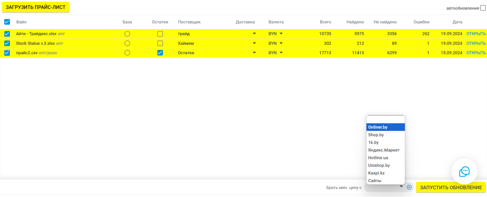

# Расценка товаров и формирование розничных цен

## 1. Общая информация



Расценка применяется только для прайсов с типом цен «ОПТ», который выбирается при загрузке прайса.



Если расценка не используется, достаточно выбрать тип цен «РОЗНИЦА».

Если в прайсе указаны две колонки («Цена» и «РРЦ»), необходимо выбрать тип цен «ОПТ». В этом случае сначала берется **РРЦ**, а при его отсутствии — **оптовая цена** (согласно правилам).

Также можно выставить приоритет для прайса, чтобы при совпадении позиций цены выставлялись именно из него. Для этого при формировании обновления напротив нужного файла отметьте галочку «Остатки».

## 2. Критерии расценки

Настройка расценки может быть выполнена по следующим критериям:

- _Интервал цен_ - Применять правило для товаров с ценой входящей в указанный интервал.
- _Поставщик_: указать нужных поставщиков, к которым применяются заданные правила.
- _Имя файла_: применить к прайс-листам с определённым названием.
- _Категория(ZMS)_: настроить расценку для выбранных категорий.
- _Производитель_: выбрать нужного производителя.

_Пример_:

## 3. Интервал цен

При настройке интервалов цен обязательно указывайте границы интервала (достаточно одной из границ):

- **≥ (минимальная цена "от")** — например, цена от 0.
- **≤ (максимальная цена "до")** — например, цена до 50.99.

_Пример_:

 Правила:
* №**1** применимо ко всем позициям с ценой от 0 и до бесконечности, для прайсов с наименованием файла **_"Sklad_price"_**
* №**2,3** применимы к позициям в интервале от 0 до 50.99, и от 51 до 99.99
* №**4** применимо ко всем позициям с ценой от 100 и до бесконечности
* №**5** применимо ко всем позициям с ценой от 0 до бесконечности, только для товаров бренда **_"Asus"_**
* №**6** применимо ко всем позициям с ценой от 0 до бесконечности, только для товаров поставщика **_"АСБИС СЗАО"_** и категории **_"Мобильные телефоны"_**
* №**7** применимо ко всем позициям с ценой от 0 до бесконечности, только для товаров поставщика **_"АСБИС СЗАО"_** и категории **_"Наушники"_**



Рекомендуется добавлять "общее" правило расценки, которое будет действовать на все товары без указания фильтров.
В этом случае все товары всегда будут расцениваться, даже когда товар не попадает ни под одно индивидуальное правило расценки.



Если в созданном правиле есть ошибка, об этом будет указывать восклицательный знак рядом с правилом.

## 4. Основные значения

- _Наценка_ — сумма, на которую повышена цена (число в валюте, % или формула). Если нет конкурентов.
- _Минимальная наценка_ — применяется только **при наличии конкурентов**.
- _Минус от минимальной цены конкурентов_ — сумма, на которую уменьшается минимальная цена конкурента, при условии, если на товар возьмется мин. цена конкурента.
- _Минимальная розничная наценка_ — если разница между РРЦ и входной ценой меньше определенного %, цена формируется как "входная цена + % указанный в этой ячейке"



  У вас есть определённый минимум по наценке, ниже которого вы не хотите работать. В этом случае, если разница между оптовой ценой и РРЦ будет ниже данного значения, система выставит цену по формуле: "ОПТ + Минимальная розничная наценка %".



- _Приоритет_ — многоуровневая система наценки: сначала применяется одно правило (например, скидка), затем другое (наценка). Пересчет работает по порядку указаному в столбце приоритет по порядку.

Пример:

- К прайсу поставщика сначала применяется правило с приоритетом "0" (входная цена - 2%). Затем применяется правило с приоритетом "1" (цена -2% + наценка) и т.д.



Все значения должны быть указаны в валюте результата (в той, в которой обновляете магазин), а не в валюте прайса.



## 5. Расценка под минимальные цены конкурентов

Если необходимо выравнивать цены по минимальным ценам конкурентов:

- В столбце _«Наценка»_ укажите значение "0" — если нет конкурентов, цена берется из прайса.
- В столбце «Минимальная наценка» укажите "-50 000" (или другое большое отрицательное число) — все цены будут выравниваться по минимальным.

Пример:

- Используйте минимальные цены конкурентов с торговых площадок (например, Onliner).

Проверьте, чтобы для соответствующих вкладок были прописаны соответствия по товарам. Цены конкурентов не учитываются для позиций без соответствий. (Товары из блока "[Найдено](*Найдено)")

## 6. Фильтры

Для быстрого поиска или сортировки параметров расценок можно использовать фильтры, доступные в верхней части страницы. Фильтры работают по следующим критериям: **категория**, **производитель**, **поставщик**.

Если поставщик, производитель или категория не указаны, правило применяется ко всем товарам.

## 7. Курсы валют

В общих настройках аккаунта (вкладка «Настройки») можно задать курс валюты с привязкой к Национальному банку. Например, для курса НБРБ + 2% используйте формулу `[NBRB]+2%`.

На странице «Расценка» можно задать отдельный курс для каждого поставщика.

## 8. Черный и белый список конкурентов

При формировании цен можно использовать черный и белый список конкурентов:

- **Использовать цены конкурентов** — добавьте только названия магазинов, цены которых нужно учитывать.
- **Исключать при расценке конкурентов** — расценка выполняется по всем конкурентам, кроме тех, что внесены в черный список.

Пример:

| Список конкурентов     | Описание                   |
|------------------------|----------------------------|
| **Белый список**       | Магазин 1, Магазин 2       |
| **Черный список**      | Магазин 3                  |

[*Найдено]: 

