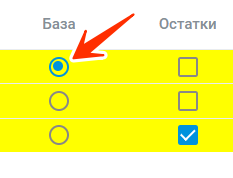

### Обновление цен и наличия на сайте

Для корректного обновления цен и наличия товаров на вашем сайте выполните следующие шаги.

## 1. Настройка постоянной ссылки для выгрузки товаров

Создайте постоянную ссылку на файл в одном из следующих форматов: **{{ supported-formats }}**. При обращении по этой ссылке мы сможем получать актуальный список товаров, включая неактивные и отсутствующие в продаже. Данные для передачи:



Пример ссылки: `http://www.mypc.by/export.csv`

## 2. Загрузка прайс-листов поставщиков

Настройте [автоматическую загрузку](../sites-update/price-handler/price-handler-auto.md) прайс-листов поставщиков по постоянным ссылкам (из почты, Google Документов, FTP и т.д.) через вкладку **«Настройка»** — раздел **«Настройка прайсов»**.
Или на вкладке **«Обработка прайсов»** - [загрузить](../sites-update/price-handler/price-handler.md) нужные прайс-листы поставщиков.

## 3. Настройка правил ценообразования

На вкладке **«Настройка»** — раздел **«Расценки»** настройте [правила формирования цен](../sites-update/pricing/quotation.md) для пересчета по загруженным прайс-листам.

## 4. Сопоставление товаров

После загрузки прайс-листов через раздел **«Обработка прайсов»** [сопоставьте](../mapping/mapping-instruction-file.md) товары по каждому поставщику. Товары, которые не были автоматически найдены, необходимо сопоставить вручную с помощью поиска по модели.

## 5. Обновление данных

Сформируйте обновление данных по загруженным прайс-листам, галочками выделяете нужные прайсы и нажимаете «Запустить обновление» после чего информация обновится в [API](*api) и на вкладке прайс. Система автоматически запускает скрипт для обновления цен и наличия на сайте по **ID товара**.



Галочку «Остатки» нужно отмечать в том случае, если необходимо выставить приоритет по прайсу (т.е при пересечении позиций, цены в первую очередь, будут выставляться именно из него).
Обычно отмечается, если это складские остатки.



## 6. Интеграция с сайтом через API

Для интеграции сайта используйте наше [API](*api) (формат **JSON**). Документация доступна по ссылке: 

[https://help.zoomos.by/api/](../../api/index.yaml)

## 7. Использование собственной базы товаров

Если вы используете собственную базу товаров, отметьте файл с выгрузкой **«База»**.



 

 При необходимости настройте [приоритеты](../sites-update/pricing/priorities.md) для остатков и цен, основываясь на выбранных источниках прайс-листов.

## 8. Дополнительные настройки

Если необходимо использовать цены конкурентов при формировании розничных цен, в выпадающем меню «Брать мин. цену с» выберите торговую площадку:

После этого можно проверить итоговые цены на странице **«Прайс»** (на данной странице проверяйте столбец с **«Итоговая цена»**, именно она уйдет на сайт).

[*api]: 